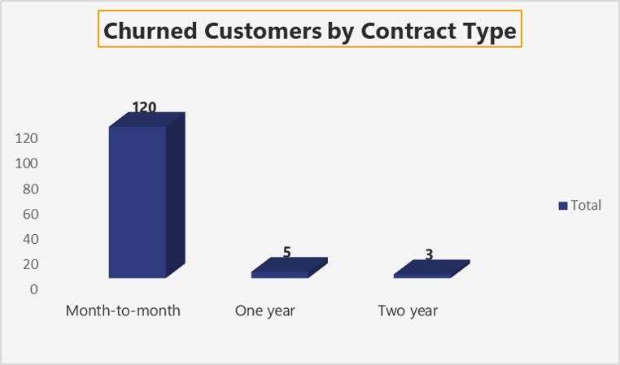
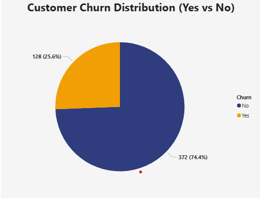
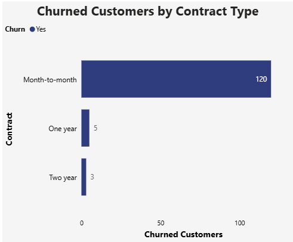
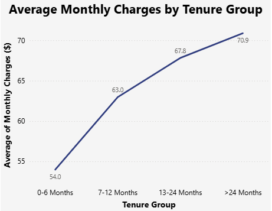

# Telco Customer Churn Analysis
Analyzed a 500-row Kaggle dataset using SQL, Excel, and Power BI.
- **SQL**: Churn rate by contract (42.4% for month-to-month), tenure distribution (0–6 Months: 58 churned).
- **Excel**: Bar chart for churn by contract (Month-to-month: 120, One year: 5, Two year: 3).
- **Power BI**: Pie chart (25.6% churn), bar chart (120, 5, 3), line chart (MonthlyCharges by tenure: 54.0–70.9).
Key insight: Month-to-month contracts have the highest churn rate, suggesting retention strategies.

**Dataset**: [Download](Telco_Customer_Churn_500.csv)
**Contract SQL**: [view](churn_by_contract.sql)
**Tenure SQL**: [view](tenure_churn.sql)
**Excel Bar Chart**:

**Power BI Pie Chart**:

**Power BI Bar Chart**:

**Power BI Line Chart**:

